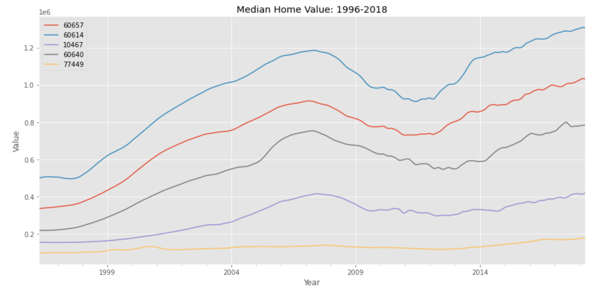
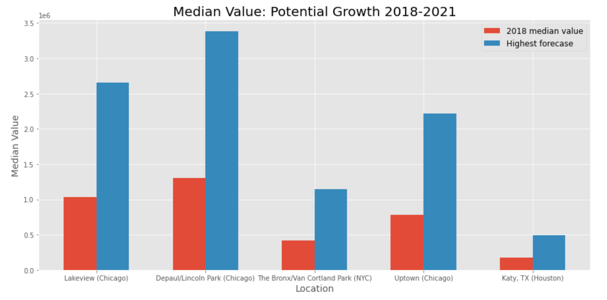
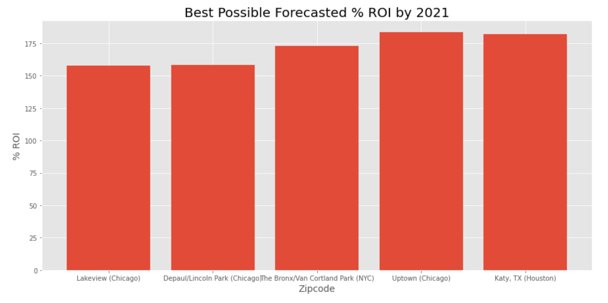

# Zipcodes for Millennials: Where You Should Invest in a Home

As some of the youngest millennials begin to turn 30, the prospect of home ownership is becoming more of a priority for investment. According to the Zillow Consumer Housing Trends Report for 2021, 26 percent of homebuyers are between the ages of 30 and 39. The majority of millennials fall within this age range, with even the youngest millennials turning 30 each year.

This project seeks to identify the top five zipcodes for millennials to invest in a home.

# Business Understanding

My clients are first-time homebuyers who are millennials. I know my clients have incomes in the average, middle-of-the-road range and seeking to know what return on their investment may they see in the first two years.

To measure "best" zipcode based on our client profile, I will evaluate long-term (22 years) and short-term (5 years) return on investment and will forecast median home values out two years.

I will provide clients a range of recommendations, from more safe investments (with less variation in forecast) to more risky investments (with more variation in forecast). Further, I'll provide clients a measure error, so that they may make as informed decision as they can.

## Data Understanding

The data used in this time series modeling comes from the [Zillow Research Page](https://www.zillow.com/research/data/) and includes monthly median home values for over 14,000 zipcodes in the United States dating back to 1996.

## Evaluation of "Best" Zipcodes

To narrow down our list of prospective zipcodes, I focus on cumulative ROI (over the 22 years of the full dataset) and the ROI of the most recent five years.

When making predictions using the model, I evaluate its performance using the mean absolute error, so that I can convey to the clients the dollar amount predictions may be off by.

Lastly, I also include the median home value as a data point to consider for investment as homebuyers will having varying levels of cash on hand with which to make their investment.

## Exploratory Data Analysis

To help refine the dataset for the purposes of this business problem, I computed the cumulative percent change of home values for the whole dataset, from 1996 to 2018 as well as the most recent percent change in home values over the most recent five years (2012-2018).

I created individual dataframes for each computed value, so that I could trim each dataframe to only include the Interquartile Range.

I am only including data values within the IQR to meet the business needs of millennials who are first-time homebuyers. Home values above the 75th percentile and below the 25th percentile will not be appropriate homes to include for prospects.

After completing this initial subsetting to narrow our list of 14,000 zipcodes down to 5, there are some initial observations.

* Three of the five zipcodes are in Chicago: Lakeview, Depaul/Lincoln Park, and Uptown
* One zipcode is in the Bronx (Van Cortland Park)
* One zipcode is an up-and-coming western suburb (Katy, TX) of Houston



# Modeling Description

For modeling, I subset the data to only include values beginning with 2011. This minimizes the outlier affect of the 2008-2009 housing crash on predictions and forecasts.

**A note on the usage of the SARIMA Model:**

The SARIMA model stands for "Seasonal AutoRegressive Integrated Moving Average" model, so in one swoop, the model can conduct auto-regression, moving average, the integration or differencing of the two, and include the seasonal component of the data.

***

**A note on the SARIMA Parameters:**
Per the formula SARIMA(p,d,q)x(P,D,Q,s), the parameters for these types of models are as follows:

* $p$ and seasonal $P$: indicate number of autoregressive terms (lags of the stationarized series, based on past data points)
* $d$ and seasonal $D$: indicate differencing that must be done to stationarize series (accounting for the overall 'trend' in the data)
* $q$ and seasonal $Q$: indicate number of moving average terms (lags of the forecast errors, based on noise of past data points)
* $s$: indicates seasonal length in the data (in this case, 12 months)

This project utilized a grid search of all the different model iterations with different combinations of pdq and pdqs. For the final model, the pdq and pdqs values were selected based on the smallest AIC value - the AIC is a metric that is an estimator of out-of-sample prediction error; a lower AIC score indicates a more predictive model.

***

**A note on SARIMA Model performance evaluation:**

I evaluate how well each model performs by calculating the Mean Absolute Error, which is a measure of errors between paired observations expressing the same phenomenon - in this case median home value.

# Results

1. The zipcode model with the smallest MAE of only 4,466 was Katy, TX (77449)
2. The zipcode forecast with the smallest 95% confidence interval range (thus perhaps the less risky) is also Katy, TX, with a range of only 213,981
3. On the contrary, the zipcode model with the highest MAE was Depaul/Lincoln Park of Chicago (60614) at 58,447
4. Depaul/Lincoln Park also has the widest confidence interval range, incidating a more risky option, with a range of 1,472,587


***


# Recommendations

For those clients who may be more risk-averse, possibly with less cash on hand, Katy, TX (77449) and The Bronx/Van Cortland Park (10467) may be the best zipcodes in which to invest because:

* In Katy, the median home value in 2018 was 176,200 and our model predictions only deviated by as much as 4500. Further, forecasted Katy home values two years out have a less varied range than other zipcodes. Thus, in two years, we can expect home values to increase on the low end to 282,755 and the high end 496,736.

* In the Bronx, the median home value in 2018 was 417,900 and our model predictions deviated by as much as 13,507. Further, forecasted home values in the Bronx two years out have a less varied range than other zipcodes. Thus, in two years, we can expect home values to increase on the low end to 787,352 and the high end 1,140,162.

***

For those clients who may be more willing to take a risk, and perhaps with more cash on hand, the Lakeview and Depaul/Lincoln Park neighborhoods of Chicago may be the best zipcobes in which to invest because:

* In Lakeview, the median home value in 2018 was 1,030,600. In making our predictions, our model deviated by as much as 44,097. Forecasted Lakeview home values two years out have a more varied range than other zipcodes. Thus, in two years, we can expect home values to increase on the low end to 1,790,041 and the high end 2,654,675.

* In Depaul/Lincoln Park, the median home value in 2018 was 1,307,000. In making our predictions, our model deviated by as much as 58,447. Forecasted Depaul/Lincoln Park home values two years out have a more varied range than other zipcodes. Thus, in two years, we can expect home values to increase on the low end to 1,905,924 and the high end 3,368,511.

***

For clients looking for a good, middle-of-the-road investment zipcode with an above average median home value and moderate error in predictions, the Uptown neighborhood of Chicago would be a sound option. In Uptown, the median home value in 2018 was 782,800. In making our predictions, our model deviated by as much as 27,626. Forecasted Uptown home values two years out do have a more varied range than other zipcodes, which we may note of in terms of potential risk. Thus, in two years, we can expect home values to increase on the low end to 1,084,583 and the high end 2,218,113.

# Future Work

I can draw additional data on median incomes, population size, housing demand, cost of living, community attributes, etc. to better ascertain zipcodes of interest worth modeling.

# For More Information

Please review our full analysis in [our Jupyter Notebook](./index.ipynb) or our [presentation](./ppt-time-series-presentation.pdf).

For any additional questions, please contact **Rebecca Frost-Brewer (frostbrewerr@gmail.com)**

# Repository Structure

```
├── README.md                         <- The top-level README for reviewers of this project
├── index.ipynb                       <- Narrative documentation of analysis in Jupyter notebook
├── img
    ├── line-plot.png
    ├── roi.png
    └── value-increase.png
├── jnb-time-series.pdf               <- PDF of jupyter notebook
├── ppt-time-series-presentation.pdf  <- PDF version of project presentation
├── readme-time-series.pdf            <- PDF of github readme
└── zillow_data.csv                   <- Sourced externally
```
